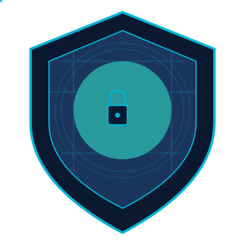

# PhishShield - Cybersecurity Web Application

PhishShield is a comprehensive cybersecurity web application designed to help users detect phishing threats, analyze suspicious URLs and emails, test their knowledge with interactive quizzes, and learn about cybersecurity best practices.



## Features

### Home Page
- Engaging cybersecurity-themed UI with animated particles and shield visualization
- Quick access to all features through animated cards
- Dark/light mode toggle for comfortable viewing
- Responsive design for all device sizes

### URL Inspection Tool
- Deep analysis of URLs for phishing risks
- Checks domain reputation, SSL certificates, and suspicious patterns
- Provides risk scores and detailed breakdown of findings
- Offers safety recommendations based on analysis results

### Email Analyzer
- Examines email headers and content to detect phishing attempts
- Analyzes SPF/DKIM/DMARC authentication results
- Detects suspicious links, urgency language, and other red flags
- Highlights potential threats in email content

### Cybersecurity Quiz
- Three categories: Phishing Basics, Email Security, and URL & Web Threats
- 5 questions per category with immediate feedback
- Detailed explanations for correct and incorrect answers
- Score tracking and performance review

### Education Hub
- Comprehensive resources on phishing and cybersecurity
- Topics include: What is Phishing, Common Attack Types, How to Spot Phishing, and Best Practices
- Visual diagrams and explanations of attack methods
- Searchable content for quick reference

## Technologies Used

- HTML5 (Semantic tags)
- CSS3 (Flexbox/Grid, animations, responsive design)
- JavaScript (DOM manipulation, interactive features)
- Libraries:
  - Particles.js (Homepage animation)
  - Font Awesome (Icons)
  - Google Fonts (Typography)

## Setup Instructions

1. Clone the repository:
   ```
   git clone https://github.com/AjayPrajapati83/PhishShield.git
   ```

2. Navigate to the project directory:
   ```
   cd PhishShield
   ```

3. Open the project in your preferred code editor

4. To view the application, open `index.html` in a web browser

## Live Demo

You can access the live version of PhishShield at: [https://ajayprajapati83.github.io/PhishShield/](https://ajayprajapati83.github.io/PhishShield/)

## Project Structure

```
phishshield/
├── index.html                  # Home page
├── url-inspector.html          # URL analysis tool
├── email-analyzer.html         # Email analysis tool
├── quiz.html                   # Cybersecurity quiz
├── education.html              # Educational resources
├── assets/
│   ├── css/
│   │   └── styles.css          # Main stylesheet
│   ├── js/
│   │   ├── script.js           # Main JavaScript file
│   │   ├── url-inspector.js    # URL inspector functionality
│   │   ├── email-analyzer.js   # Email analyzer functionality
│   │   ├── quiz.js             # Quiz functionality
│   │   └── education.js        # Education hub functionality
│   └── images/                 # Images and SVG graphics
└── README.md                   # Project documentation
```

## Usage

### URL Inspector
1. Navigate to the URL Inspector page
2. Enter a URL in the input field
3. Click "Analyze URL"
4. Review the detailed analysis results and safety recommendations

### Email Analyzer
1. Navigate to the Email Analyzer page
2. Choose whether to analyze headers, content, or a full email
3. Paste the email content into the appropriate field
4. Click "Analyze Email"
5. Review the analysis results and highlighted suspicious elements

### Cybersecurity Quiz
1. Navigate to the Quiz page
2. Select a category (Phishing Basics, Email Security, or URL & Web Threats)
3. Answer the questions and receive immediate feedback
4. Review your final score and explanations

### Education Hub
1. Navigate to the Education Hub page
2. Browse topics using the sidebar navigation
3. Use the search function to find specific information
4. Download PDF guides for offline reference

## Browser Compatibility

PhishShield is compatible with all modern browsers:
- Google Chrome
- Mozilla Firefox
- Microsoft Edge
- Safari
- Opera

## License

This project is licensed under the MIT License - see the LICENSE file for details.

## Disclaimer

PhishShield is designed for educational purposes only. The analysis provided by the tools should not be considered as definitive security assessments. Always exercise caution when dealing with suspicious URLs and emails.

## Future Enhancements

- Integration with real-time phishing databases
- Machine learning-based analysis for improved accuracy
- User accounts to save analysis history
- Mobile app version for on-the-go security checks
- API access for developers to integrate PhishShield features

---

© 2025 PhishShield. All rights reserved.
